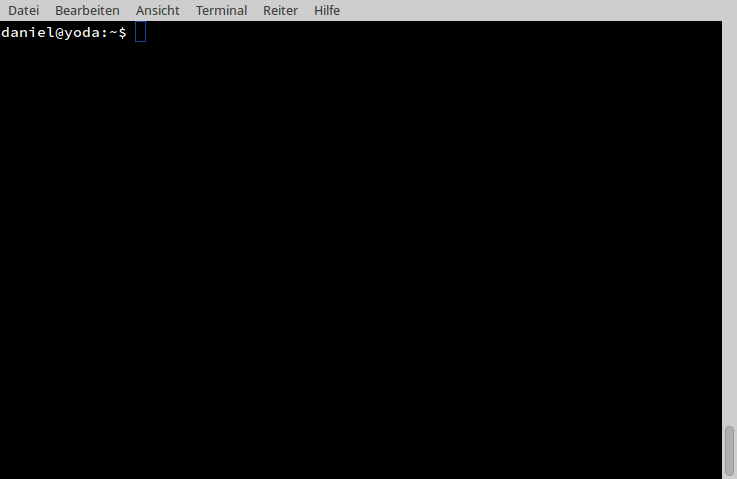

This is a fork to add fuzzy search functionality to password-store.



#Usage:

Type `pass **` and hit tabulator to start the fuzzy search. Hit Return or Ctrl+Return to select the password.
 
```bash
pass **<TAB>
```
#Install:

Select and install one of the recommended fuzzy search commands listed below:

Recommended:

- fzf (Written in Go)
  https://github.com/junegunn/fzf
- pick (Written in C) (Press Ctrl + Return to select password)
  https://github.com/thoughtbot/pick
- icepick (Written in Rust) (Press Ctrl + Return to select password)
  https://github.com/felipesere/icepick
- selecta (Written in Ruby) (Press Ctrl + Return to select password)
  https://github.com/garybernhardt/selecta

Clone this repository : 

```bash
git clone https://github.com/d4ndo/password-store.git
cd password-store
make install-common
```

Set the fuzzy search command for password-store to use in .bashrc. In this example it is `PASSWORD_STORE_FUZZY="fzf"`.

~.bashrc

```bash
export PASSWORD_STORE_FUZZY="fzf"
source "/usr/share/bash-completion/completions/pass"
```

Troubleshooting: Set the source where to find bash completion.


Depends on:

- bash
  http://www.gnu.org/software/bash/
- GnuPG2
  http://www.gnupg.org/
- git
  http://www.git-scm.com/
- xclip
  http://sourceforge.net/projects/xclip/
- pwgen
  http://sourceforge.net/projects/pwgen/
- tree >= 1.7.0
  http://mama.indstate.edu/users/ice/tree/
- GNU getopt
  http://www.kernel.org/pub/linux/utils/util-linux/
  http://software.frodo.looijaard.name/getopt/
	
